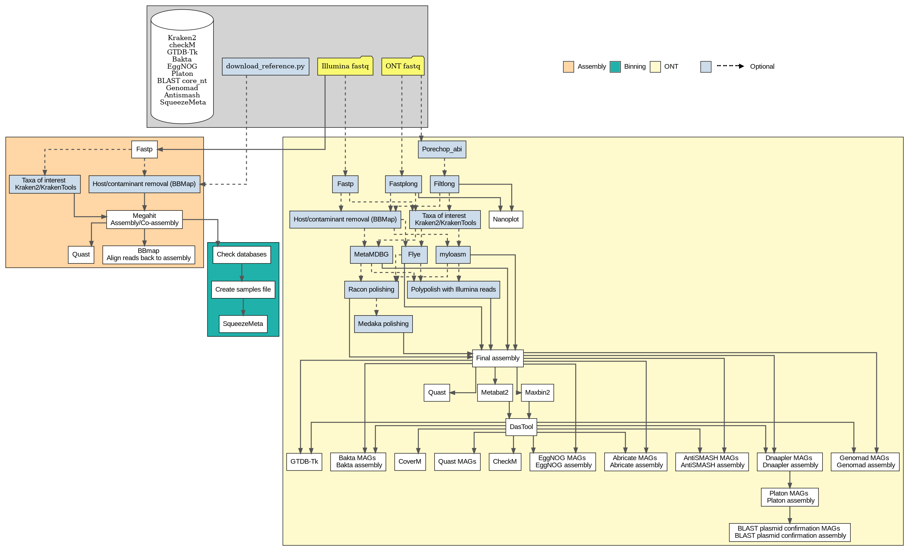

# TheHobBIN

A nextflow workflow for Metagenomics with short- and/or nanopore read assembly, QC, Binning and functional annotations. The Nanopore workflow can also use Illumina reads for polishing the assemblies.




## Table of contents
1. [Description](#1-description)
2. [Installation](#2-installation)
3. [Databases](#3-databases)
4. [Configuration](#4-configuration)
5. [Usage](#5-usage)
6. [Citation](#6-citation)
7. [References](#7-references)

## 1. Description
### The workflow for Illumina reads
1. **Pre-processing**  
   - Fastp for quality trimming and adapter's removal.  
   - Contaminant/host reads removal, either with kraken2 and kraken tools to select the reads of the taxa to keep, or use NCBI accession number to remove the reads identified as contaminant/host.  

2. **Assembly**  
   - Assembles filtered reads with Megahit.
   - Metaquast for quality assessment of the Assembly (N50, L50, etc).
   - % of reads mapped back to the Assembly with BBmap.  
  
4. **Binning and annotations**
   - Automatically create the samples file required by SqueezeMeta.
   - SqueezeMeta workflow is used for all the annotations (functional and taxonomical) and Binning.  

### The workflow for ONT reads  
1. **Pre-processing**  
   - fastplong for quality trimming and adapter's removal.  
   - Visualizations of sequencing data in fastq.  
   - Contaminant/host reads removal, either with kraken2 to select the reads of the taxa to keep, or use NCBI accession number to remove the reads identified as contaminant/host (for both Nanopore and Illumina reads).
     
2. **Assembly**  
   - Assembly with flye, myloam or MetaMDBG.
   - Metaquast for quality assessment of the Assembly (N50, L50, etc).    

3. **Polishing**
   - Option to run Racon polishing with several rounds.
   - Option to run Medaka single round to generate a consensus sequence from the assembled contigs and the ONT reads.  
   - Polypolish is used automatically to polish the ONT assembly if Illumina reads  are given as input.

4. **Binning**
   - Maxbin2 and Metabat2 and the required preparation of input files are performed to obtain metagenomic assembled genomes (MAGs).
   - dasTool is used for the MAGs refinment.  
   - Completeness and contamination are evaluated with checkM.  

5. **Taxonomic assignment**
   - GTDB-TK for taxonomic assignment with the Genome Taxonomy Database (GTDB).

6. **MAGs quantification**
   - MAGs quantified with coverM.

\
**The following steps are performed at the MAGs and assembly level:**
\
\
\
8. **Gene/Functional annotations**
   - Contigs are annotated with Bakta.
   - EggNOG-mapper provides further functional annotations.
     
9. **Secondary metabolites**
   - Antismash secondary to search for metabolite biosynthesis gene cluster.  

10. **Antimicrobial resistance (AMR)**  
    - Abricate for screening of contigs for antimicrobial resistance or virulence genes. It has several databases which are all used in this workflow (NCBI, CARD, ARG-ANNOT, Resfinder, MEGARES, etc).
    

12. **Plasmids**  
    - dnappler is used to re-orient circular genomes by repA or terA in case of prophages.  
    - Planton is used for plasmid detection.  
    - .  

14. **Prophages**  
    - Viral sequences are searched with geNomad.

[↑ Back to top](#table-of-contents)
    
## 2. Installation  
- Nextflow >= v24.10.4 is required 

The workflow may be installed via conda:  
```
conda create -y -n name -c bioconda nextflow my_package
conda activate my_package
```  
**or**  

by downloading the latest repository:
```
git clone https://github.com/fdcerqueira/Blabla.git
```
  
[↑ Back to top](#table-of-contents)

## 3. Databases   

**The directories of all the required databases are defined in the configuration file. Missing databases will be automatically downloaded.**
   
  - The SqueezeMeta database for the Illumina short reads workflow requires ~ 470Gb of disk space.
  
  - XXX downloads automatically all dependencies and databases. Though, it is highly recommended to download them manually since it is ~640Gb. Presented bellow are the databases required to run the workflow, with their repective sizes after decompression. The easier way to get most databases is by using conda. To increase speed is higly advisible to install micromamba (https://mamba.readthedocs.io/en/latest/installation/micromamba-installation.html), by using the command: ```"${SHELL}" <(curl -L micro.mamba.pm/install.sh)```. The micromamba install commad is the following ```micromamba create -y -n <name_evironment> --channel-priority flexible -c bioconda <package> ```.
\
\
  checkM (~300Mb)  
  GTDB (~140Gb)  
  Bakta (~71GB)  
  EggNOG (~40Gb)  
  Platon (~2.8Gb)  
  BLAST (~274Gb)  
  Genomad (~1.4Gb)  
  Antismash (9.4Gb)  
  Kraken2 (standard database: 74Gb)

```
#antismash database
conda create -y -n antismash -c bioconda antismash=7.1.0=pyhdfd78af_0 python=3.9
conda activate antismash
download-antismash-databases --database-dir /path/to/destination/folder

#GTDB database
wget -c https://data.gtdb.ecogenomic.org/releases/release226/226.0/auxillary_files/gtdbtk_package/full_package/gtdbtk_r220_data.tar.gz
tar xzvf gtdbtk_r226_data.tar.gz -C /path/to/destination/folder
rm gtdbtk_r226_data.tar.gz

#Bakta database (the recomended full database)
wget -c https://zenodo.org/records/10522951/files/db.tar.gz
tar -xzf db.tar.gz -C /path/to/destination/folder
rm db.tar.gz

#EggNOG database
conda create -y -n eggnog-mapper1 -c bioconda eggnog-mapper=2.1.12 python=3.12 diamond=2.1.9
conda activate eggnog-mapper1
mkdir /path/to/destination/folder
download_eggnog_data.py -y /path/to/destination/folder

#Platon database
wget -c https://zenodo.org/record/4066768/files/db.tar.gz
tar -xzf db.tar.gz -C /path/to/destination/folder
rm db.tar.gz

#NCBI core_nt database
conda create -y -n blast -c bioconda blast=2.16.0
conda activate blast
mkdir /path/to/destination/folder
update_blastdb.pl --decompress --num_threads 0 core_nt
mv core_nt* /path/to/destination/folder

wget -c 'ftp://ftp.ncbi.nlm.nih.gov/pub/taxonomy/taxdump.tar.gz'
tar -zxvf taxdump.tar.gz -C /path/to/destination/folder
rm taxdump.tar.gz

wget 'ftp://ftp.ncbi.nlm.nih.gov/blast/db/taxdb.tar.gz'
tar -zxvf taxdb.tar.gz -C /path/to/destination/folder
rm taxdb.tar.gz

wget -c 'ftp://ftp.ncbi.nih.gov/pub/taxonomy/accession2taxid/nucl_gb.accession2taxid.gz'
gunzip -c nucl_gb.accession2taxid.gz > /path/to/destination/folder/nucl_gb.accession2taxid

#Genomad database
conda create -y -n genomad flexible -c bioconda genomad=1.8.0
conda activate genomad
mkdir /path/to/destination/folder
genomad download-database /path/to/destination/folder

#checkM database
mkdir /path/to/destination/folder
wget -c "https://data.ace.uq.edu.au/public/CheckM_databases/checkm_data_2015_01_16.tar.gz"
tar -xzf checkm_data_2015_01_16.tar.gz -C /path/to/destination/folder
rm checkm_data_2015_01_16.tar.gz
export CHECKM_DATA_PATH=/checkm_data_dir
checkm data setRoot /checkm_data_dir

#kraken2 database
conda create -y -n kraken2 -c bioconda kraken2=2.1.6
conda activate kraken2
mkdir /path/to/destination/folder
kraken2-build --standard2 --db /path/to/destination/folder --threads <whatever number>

#SqueezeMeta
conda create -n squeezemeta -c conda-forge -c bioconda -c fpusan squeezemeta=1.4 --no-channel-priority --override-channels
conda activate squeezemeta
download_databases.pl /path/to/destination/folder
test_install.pl /path/to/destination/folder
```
  
[↑ Back to top](#table-of-contents)
  
## 4. Configuration  
Before using **my_pipe.nf** the configuration file **my_config.config** needs to be edited. The params section is divided into several sub-sections.  
\
**//general:**  
```max_jobs``` which allows to choose the maximum number of tasks that can be handled in parallel(0=no limit).  
```cores``` is the number of cpus used per task. 
```MEM``` memory to be used by the SqueezeMeta pipeline. 
\
**//memory for bbmap:**  
```mem``` Memory to be used by bbmap either to remove host contamination or to map the reads back to the assembly (e.g. 200g).  
\
**//input:**  
```input``` refers to the Illumina reads files location. The files must either end as ```_R{1,2}.fastq.gz``` or ```_{1,2}.fastq.gz```. This pattern should be added to the path. e.g. "/path/to/fastq/*_{1,2}.fastq.gz" or "/path/to/fastq/*_{R1,R2}.fastq.gz".  
```input_long_reads```, is the path to the ONT reads directory. The ONT reads must end ```_1.fastq.gz```. e.g. /path/to/fastq.  
```output``` select output folder.  
```host``` Is the NCBI accession number of host organism/contaminant to be removed (e.g. NC_000913.2). The default option is null. Therefore his process only runs is an organism is specified.  
```filter_taxa_interest``` The alternative approach is to retreive the taxa of interest from all the reads (done through kraken2 and kraken tools). In this case is the NCBI taxonomy ID (https://www.ncbi.nlm.nih.gov/Taxonomy) that should be used. If more that one taxa of interest has to extracted then they should be separated by a space, e.g. "2 2157", the 2 is for Bacteria and 2157 for Archaea.  
\
**//parameters megahit assembly:**  
```assembly_mode``` the three modes of assembly for megahit assembly. ```default``` is the megahit default assembly k-min (21), k-max(141) and k-step(12), the options bellow should be left empty. ```regular``` The k-mer sizes need to be specified in the options bellow. e.g ```assembly_mode="regular", min="81", max="121", step="20"```. The ```no_mercy``` parameter like the previous option, requires the k-mer sizes and step to be specified.  
\
**//polishing ONT reads:**  
If ```input``` for Illumuna reads is given. Polypolish will be used automatically to polish the ONT assemblies. In this case set ```racon_rounds``` and/or ```medaka_rounds``` to 0.  

```racon_rounds``` allows to set up the number of rounds for ONT assembly with flye to be polished. The default is set to 0. The maximum number of rounds is 4. 
```medaka_rounds```choose if medaka polishing of the ONT assembly with flye is necessary. The default is 0 and only 1 round of polishing is possible to do with medaka.  

\
**//squeezemeta database:**  
```database_dir``` is the directory of the SqueezeMeta database. If the database is not present, it will download automatically.  
```overwrite_database``` option to choose if the database should be overwritten (downloaded again).  
\
**//database options:**  
Here are the paths to to all the required databases. e.g.  
\
    blast_database="/path/to/NCBI_nt_core_2025.09.23"  
    checkm_database="/path/to/checkm"  
    eggnog_database="/path/to/eggnog"  
    bakta_database="/path/to/bakta_6.0"  
    platon_database="/path/to/platon"  
    genomad_database="/path/to/genomad"  
    kraken2_database="/path/to/Kraken2_core_nt_2024.09.04"  
    gtdbtk_database="/path/to/GTDB_R226/release226"  
    antismash_database="/path/to/antismash"    
    \
**IMPORTANT: //scripts location, and //binning are to be kept like they are. Please do no change anything!** 
\
[↑ Back to top](#table-of-contents)

## 5. Usage  
The main script contains three main workflows. The ```assembly``` and ```binning``` workflows are specific for **Illumina reads**. ```assembly``` performs the pre-processing, contamination removal, assembly with megahit, and assembly evaluation. ```binning``` prepares the samples files, runs SqueezeMeta pipeline for 

To run specifically each workflow:  
```
#Illumina pre-processing and assembly workflow
nextflow run my_pipe.nf -entry assembly -c my_config.config

#Illumina binning and annotations workflow
nextflow run my_pipe.nf -entry binning -c my_config.config

#ONT workflow
nextflow run my_pipe.nf -entry long_reads -c my_config.config
```
[↑ Back to top](#table-of-contents)  

## 6. Citation  

Cerqueira, F. (2026). TheHobBin: A Nextflow workflow for metagenomics from assembly to MAG annotation, supporting short-read, long-read (ONT), and hybrid sequencing data. [TheHobBin: ](https://doi.org/10.5281/zenodo.21451971)

## 7. References
**1.** Aroney, S. T. N., Newell, R. J. P., Nissen, J. N., Camargo, A. P., Tyson, G. W., & Woodcroft, B. J. (2025). CoverM: read alignment statistics for metagenomics. Bioinformatics, 41(4). https://doi.org/10.1093/bioinformatics/btaf147  
**2.** Blin, K., Shaw, S., Augustijn, H. E., Reitz, Z. L., Biermann, F., Alanjary, M., Fetter, A., Terlouw, B. R., Metcalf, W. W., Helfrich, E. J. N., van Wezel, G. P., Medema, M. H., & Weber, T. (2023). antiSMASH 7.0: new and improved predictions for detection, regulation, chemical structures and visualisation. Nucleic Acids Research, 51(W1), W46–W50. https://doi.org/10.1093/nar/gkad344  
**3.** Bouras, G., Grigson, S. R., Papudeshi, B., Mallawaarachchi, V., & Roach, M. J. (2024). Dnaapler: A tool to reorient circular microbial genomes. Journal of Open Source Software, 9(93), 5968. https://doi.org/10.21105/joss.05968  
**4.** Camacho, C., Coulouris, G., Avagyan, V., Ma, N., Papadopoulos, J., Bealer, K., & Madden, T. L. (2009). BLAST+: architecture and applications. BMC Bioinformatics, 10(1), 421. https://doi.org/10.1186/1471-2105-10-421  
**5.** Camargo, A. P., Roux, S., Schulz, F., Babinski, M., Xu, Y., Hu, B., Chain, P. S. G., Nayfach, S., & Kyrpides, N. C. (2024). Identification of mobile genetic elements with geNomad. Nature Biotechnology, 42(8), 1303–1312. https://doi.org/10.1038/s41587-023-01953-y  
**6.** Cantalapiedra, C. P., Hernández-Plaza, A., Letunic, I., Bork, P., & Huerta-Cepas, J. (2021). eggNOG-mapper v2: Functional Annotation, Orthology Assignments, and Domain Prediction at the Metagenomic Scale. Molecular Biology and Evolution, 38(12), 5825–5829. https://doi.org/10.1093/molbev/msab293  
**7.** Chaumeil, P.-A., Mussig, A. J., Hugenholtz, P., & Parks, D. H. (2020). GTDB-Tk: a toolkit to classify genomes with the Genome Taxonomy Database. Bioinformatics, 36(6), 1925–1927. https://doi.org/10.1093/bioinformatics/btz848  
**8.** Chen, S. (2023). Ultrafast one‐pass FASTQ data preprocessing, quality control, and deduplication using fastp. IMeta, 2(2). https://doi.org/10.1002/imt2.107  
**9.** Doster, E., Lakin, S. M., Dean, C. J., Wolfe, C., Young, J. G., Boucher, C., Belk, K. E., Noyes, N. R., & Morley, P. S. (2020). MEGARes 2.0: a database for classification of antimicrobial drug, biocide and metal resistance determinants in metagenomic sequence data. Nucleic Acids Research, 48(D1), D561–D569. https://doi.org/10.1093/nar/gkz1010  
**10.** Feldgarden, M., Brover, V., Haft, D. H., Prasad, A. B., Slotta, D. J., Tolstoy, I., Tyson, G. H., Zhao, S., Hsu, C.-H., McDermott, P. F., Tadesse, D. A., Morales, C., Simmons, M., Tillman, G., Wasilenko, J., Folster, J. P., & Klimke, W. (2019). Validating the AMRFinder Tool and Resistance Gene Database by Using Antimicrobial Resistance Genotype-Phenotype Correlations in a Collection of Isolates. Antimicrobial Agents and Chemotherapy, 63(11). https://doi.org/10.1128/AAC.00483-19  
**11.** Gupta, S. K., Padmanabhan, B. R., Diene, S. M., Lopez-Rojas, R., Kempf, M., Landraud, L., & Rolain, J.-M. (2014). ARG-ANNOT, a New Bioinformatic Tool To Discover Antibiotic Resistance Genes in Bacterial Genomes. Antimicrobial Agents and Chemotherapy, 58(1), 212–220. https://doi.org/10.1128/AAC.01310-13  
**12.** Gurevich, A., Saveliev, V., Vyahhi, N., & Tesler, G. (2013). QUAST: quality assessment tool for genome assemblies. Bioinformatics, 29(8), 1072–1075. https://doi.org/10.1093/bioinformatics/btt086  
**13.** Jia, B., Raphenya, A. R., Alcock, B., Waglechner, N., Guo, P., Tsang, K. K., Lago, B. A., Dave, B. M., Pereira, S., Sharma, A. N., Doshi, S., Courtot, M., Lo, R., Williams, L. E., Frye, J. G., Elsayegh, T., Sardar, D., Westman, E. L., Pawlowski, A. C., … McArthur, A. G. (2017). CARD 2017: expansion and model-centric curation of the comprehensive antibiotic resistance database. Nucleic Acids Research, 45(D1), D566–D573. https://doi.org/10.1093/nar/gkw1004  
**14.** Kang, D. D., Li, F., Kirton, E., Thomas, A., Egan, R., An, H., & Wang, Z. (2019). MetaBAT 2: an adaptive binning algorithm for robust and efficient genome reconstruction from metagenome assemblies. PeerJ, 7, e7359. https://doi.org/10.7717/peerj.7359  
**15.** Kolmogorov, M., Yuan, J., Lin, Y., & Pevzner, P. A. (2019). Assembly of long, error-prone reads using repeat graphs. Nature Biotechnology, 37(5), 540–546. https://doi.org/10.1038/s41587-019-0072-8  
**16.** Li, D., Liu, C.-M., Luo, R., Sadakane, K., & Lam, T.-W. (2015). MEGAHIT: an ultra-fast single-node solution for large and complex metagenomics assembly via succinct de Bruijn graph. Bioinformatics, 31(10), 1674–1676. https://doi.org/10.1093/bioinformatics/btv033  
**17.** Li, H. (2018). Minimap2: pairwise alignment for nucleotide sequences. Bioinformatics, 34(18), 3094–3100. https://doi.org/10.1093/bioinformatics/bty191  
**18** Lu, J., Rincon, N., Wood, D. E., Breitwieser, F. P., Pockrandt, C., Langmead, B., Salzberg, S. L., & Steinegger, M. (2022). Metagenome analysis using the Kraken software suite. Nature Protocols, 17(12), 2815–2839. https://doi.org/10.1038/s41596-022-00738-y   
**19.** Parks, D. H., Imelfort, M., Skennerton, C. T., Hugenholtz, P., & Tyson, G. W. (2015). CheckM: assessing the quality of microbial genomes recovered from isolates, single cells, and metagenomes. Genome Research, 25(7), 1043–1055. https://doi.org/10.1101/gr.186072.114  
**20.** Seemann, T. Abricate, Github https://github.com/tseemann/abricate.  
**21.** Schwengers, O., Barth, P., Falgenhauer, L., Hain, T., Chakraborty, T., & Goesmann, A. (2020). Platon: identification and characterization of bacterial plasmid contigs in short-read draft assemblies exploiting protein sequence-based replicon distribution scores. Microbial Genomics, 6(10). https://doi.org/10.1099/mgen.0.000398  
**22.** Schwengers, O., Jelonek, L., Dieckmann, M. A., Beyvers, S., Blom, J., & Goesmann, A. (2021). Bakta: rapid and standardized annotation of bacterial genomes via alignment-free sequence identification. Microbial Genomics, 7(11). https://doi.org/10.1099/mgen.0.000685  
**23.** Sieber, C. M. K., Probst, A. J., Sharrar, A., Thomas, B. C., Hess, M., Tringe, S. G., & Banfield, J. F. (2018). Recovery of genomes from metagenomes via a dereplication, aggregation and scoring strategy. Nature Microbiology, 3(7), 836–843. https://doi.org/10.1038/s41564-018-0171-1  
**24.** Tamames, J., & Puente-Sánchez, F. (2019). SqueezeMeta, A Highly Portable, Fully Automatic Metagenomic Analysis Pipeline. Frontiers in Microbiology, 9. https://doi.org/10.3389/fmicb.2018.03349  
**25.** Vaser, R., Sović, I., Nagarajan, N., & Šikić, M. (2017). Fast and accurate de novo genome assembly from long uncorrected reads. Genome Research, 27(5), 737–746. https://doi.org/10.1101/gr.214270.116  
**26.** Wick, R. R., & Holt, K. E. (2022). Polypolish: Short-read polishing of long-read bacterial genome assemblies. PLOS Computational Biology, 18(1), e1009802. https://doi.org/10.1371/journal.pcbi.1009802  
**27.** Wick, R.R,.(2023). medaka: Sequence correction provided by ONT Research. https://github.com/rrwick/Unicycler.   
**28.** Wood, D. E., & Salzberg, S. L. (2014). Kraken: ultrafast metagenomic sequence classification using exact alignments. Genome Biology, 15(3), R46. https://doi.org/10.1186/gb-2014-15-3-r46    
**29.** Wu, Y.-W., Simmons, B. A., & Singer, S. W. (2016). MaxBin 2.0: an automated binning algorithm to recover genomes from multiple metagenomic datasets. Bioinformatics, 32(4), 605–607. https://doi.org/10.1093/bioinformatics/btv638  
**30.** Zankari, E., Hasman, H., Cosentino, S., Vestergaard, M., Rasmussen, S., Lund, O., Aarestrup, F. M., & Larsen, M. V. (2012). Identification of acquired antimicrobial resistance genes. Journal of Antimicrobial Chemotherapy, 67(11), 2640–2644. https://doi.org/10.1093/jac/dks261  


